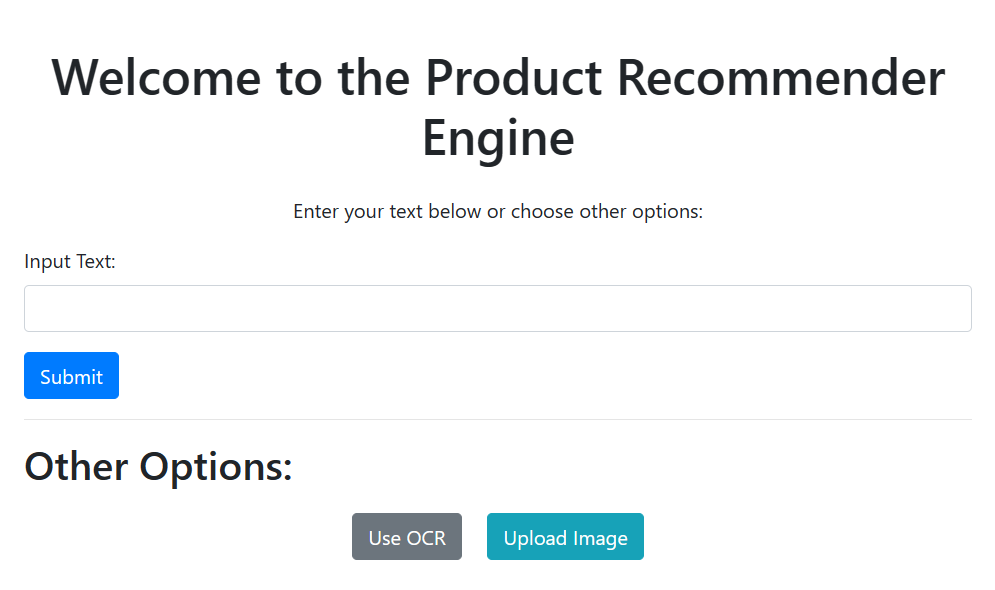

# MKD-DS-Coding-TASK

<!-- PROJECT LOGO -->
<br />
<div align="center">

  <a href="">
    
  </a>

  <h3 align="center">Product-recommendation-system</h3>

  <p align="center">
    An awesome recommendation for you
    <br />
    <br />
    <br />
    <a href="https://drive.google.com/file/d/1wx2L5XHyVrDVN0KEKQMoxWJxfleWwm0n/view?usp=sharing">View Demo</a>
  
</div>

## Folder Structure

The project follows a structured organization with the following directories:

```plaintext
project_root/
│
├── .github/
│   └── workflows/
│       └── .gitkeep
│
├── Artifacts/
│   ├── datasets/
│   │   └── (dataset)
│   ├── cleaned_datasets/
│   │   └── (cleaned datasets)
│   └── scraped_images/
│       └── (scraped images)
│
├── src/
│   └── product_recommender/
│       ├── data_preparation/
│       │   └── __init__.py
│       ├── utils/
│       │   ├── __init__.py
│       │   └── common.py
│       ├── logging/
│       │   └── __init__.py
│       ├── Webscraper/
│       │   └── __init__.py
│       ├── OCR/
│       │   └── __init__.py
│       ├── image_recognition/
│       │   └── __init__.py
│       ├── pipeline/
│       │   └── __init__.py
│       └── constants/
│           └── __init__.py
│
├── config/
│   └── config.yaml
│
├── params.yaml
├── app.py
├── main.py
├── requirements.txt
└── setup.py


```

<!-- TABLE OF CONTENTS -->
<details>
  <summary>Table of Contents</summary>
  <ol>
    <li>
      <a href="#about-the-project">Project Description</a>
      <ul>
        <li><a href="#features">Features</a></li>
        <ul>
        <li><a href="#built-with">Built With</a></li>
      </ul>
      </ul>
    </li>
    <li>
      <a href="#getting-started">Getting Started</a>
      <ul>
        <li><a href="#prerequisites">Prerequisites</a></li>
        <li><a href="#installation">Installation</a></li>
      </ul>
    </li>
    <li><a href="#usage">Usage</a></li>
    <li><a href="#roadmap">Roadmap</a></li>
    <li><a href="#contributing">Contributing</a></li>
    <li><a href="#license">License</a></li>
    <li><a href="#contact">Contact</a></li>
    <li><a href="#acknowledgments">Acknowledgments</a></li>
  </ol>
</details>

<!-- ABOUT THE PROJECT -->

## Project Description

User
Coding task project aims to develop a recommendation engine, utilizing various coding tasks and techniques to achieve optimal perform

## Features

- **Natural language query**
  use can query ptoducts in natural language and get result back in natural language

- **OCR Integration**
  Images of product can be uploaded and the system exract system and recommendation is displayed to user

- **Image Upload**
  Product image can be directly uploaded to get recommendation but this is limited to only certain products

### Built With

- Python
- Pinecone
- Flask
- Tesseract
- Pytorch

<!-- GETTING STARTED -->

## Getting Started

clone the repository to your local machine using the `git clone` command with the repository URL.

```sh
git clone https://github.com/OwusuBlessing/Code-Analysis-LLM.git
```

### Prerequisites

To set up a virtual environment, you can choose to use either Python's built-in virtual environment tools or Anaconda, depending on your preference. Open your terminal and navigate to the cloned repository directory. From there, create your virtual environment using your preferred method

- Using Python's venv Module write the following command one after the other:

  ```sh
  python -m venv myenv

  myenv\Scripts\activate

  source myenv/bin/activate

  ```

- Using Anaconda write the following command one after the other:

  ```sh
  conda create --name myenv

  conda activate myenv
  ```

After setting up your environment, ensure you have:

- An OpenAI account for API access.
- A GitHub account for repository integration.
- Python installed on your machine for running the project.

### Step 2: Sign Up for PineCone and Generate an API Key

open `.env` file and paste your tokens

```env
PINECONE_CLOUD="aws"
PINECONE_REGION="us-east-1"
PINECONE_API_KEY="Your pinecone api key"

```

Then run

```
pip install -r requirements.txt
```

To launch the application, open your terminal and enter the following command:

```
python app.py
```

This will initiate a local server, allowing you to access the application through your web browser."

<!-- USAGE EXAMPLES -->

## Usage

<!-- CONTACT -->

## Contact

Name - Owusu Samule Blessing
Email - owususammy509@gmail.com

<p align="right">(<a href="#readme-top">back to top</a>)</p>

<!-- ACKNOWLEDGMENTS -->

## Acknowledgments

Here is a list of resources that proven to be really helpful in implementing this project

_[pinecone documentation](https://docs.pinecone.io/guides/getting-started/overview)
_[flask documentation](https://flask.palletsprojects.com/en/3.0.x/)

<p align="right">(<a href="#readme-top">back to top</a>)</p>
